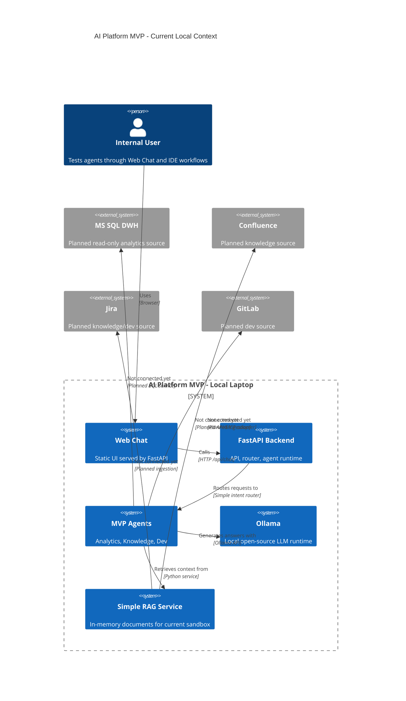
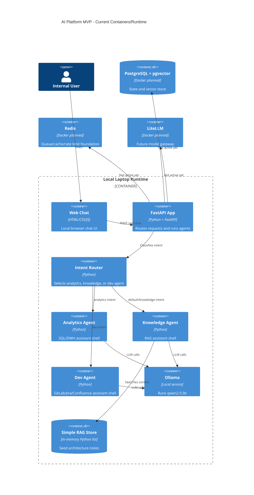

# MVP AI Platform Status

Last updated: 2026-05-04

## C4 Context

## C4 Container

## Current Component State

| Component | State | Current details |
| --- | --- | --- |
| Web Chat | Active | `http://127.0.0.1:8000/` |
| FastAPI backend | Active | `http://127.0.0.1:8000/api` |
| Intent Router | Active | Keyword-based routing |
| Analytics Agent | Active shell | No MS SQL connection yet |
| Knowledge Agent | Active shell | Uses simple in-memory RAG notes |
| Dev Agent | Active shell | No GitLab/Jira/Confluence API connection yet |
| Ollama | Active | Local runtime at `http://127.0.0.1:11434` |
| Current chat LLM | Active | `qwen2.5:3b`, model id `357c53fb659c`, size `1.9 GB` |
| Additional local LLM | Available | `llama3.2:3b`, model id `a80c4f17acd5`, size `2.0 GB` |
| LiteLLM | Planned | Compose config exists, not active locally |
| PostgreSQL + pgvector | Planned | Compose/schema exists, not active locally |
| Redis | Planned | Compose config exists, not active locally |
| Docker Compose deployment | Prepared | Docker CLI not available in current PATH |

## Data Access State

| Source | State | Notes |
| --- | --- | --- |
| MS SQL DWH | Not connected | Need read-only DSN/service account and allowlisted queries/views |
| Confluence | Not connected | Need base URL/token and ingestion job |
| Jira | Not connected | Need base URL/token and ingestion/dev adapter |
| GitLab | Not connected | Need base URL/token and project access |
| Local architecture notes | Active | Seeded in `SimpleRagService` |

## Next MVP Work

1. Replace in-memory RAG with persistent `PostgreSQL + pgvector`.
2. Add ingestion pipeline for local files first, then Confluence/Jira.
3. Add MS SQL read-only query service with allowlist, row limits, and audit log.
4. Add GitLab/Jira adapter for Dev Agent.
5. Add LiteLLM as the model gateway once Docker/local server deployment is ready.
6. Add minimal observability: request id, agent id, selected model, latency, tool calls.
